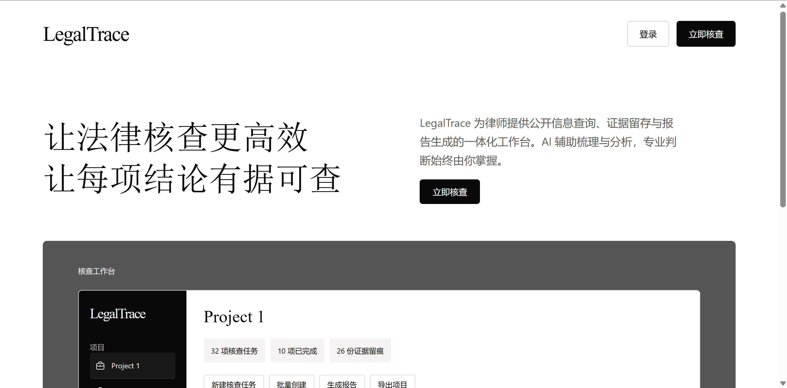
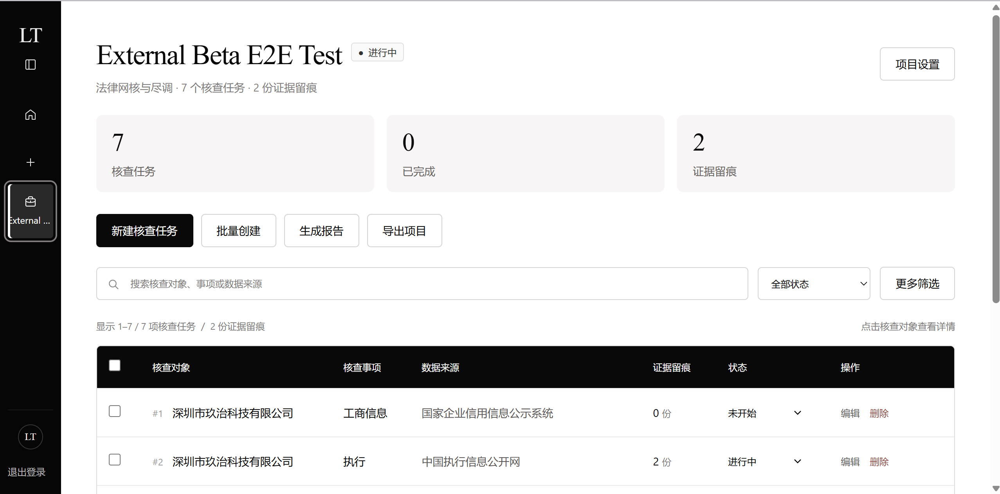
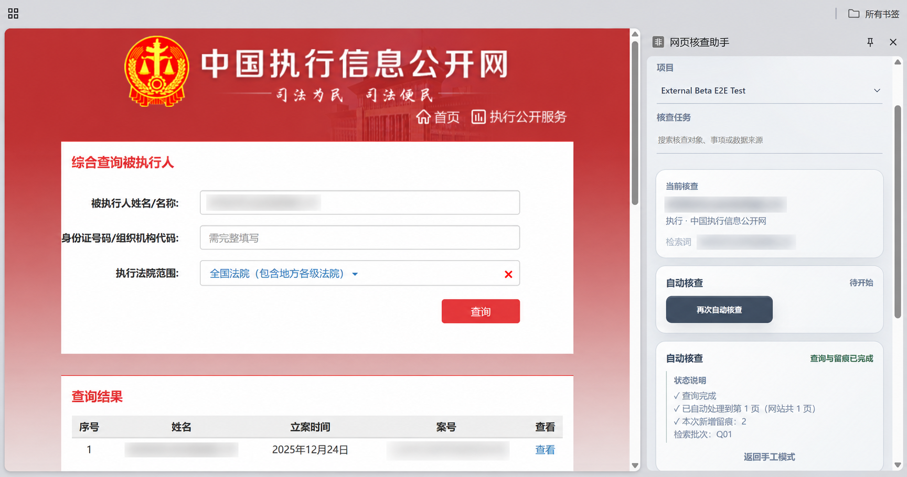
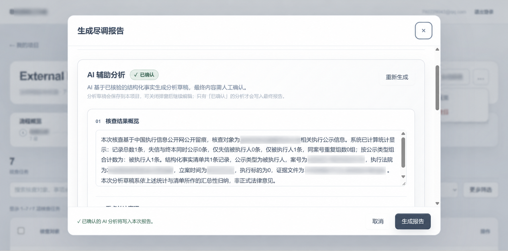

# LegalTrace

LegalTrace 是一款面向律师与法律从业者的**公开信息核查工作台**。它把「在公开网站上查询 → 留存证据 → 结构化整理 → AI 辅助分析 → 生成尽调报告」这条目前在浏览器、截图、表格和文档之间来回搬运的链路，收进同一套连续的工作流。

- **产品形态：** Web 工作台 + Chrome 网页核查助手
- **当前数据源：** 中国执行信息公开网
- **在线版本：** <https://legal-web-verification-workbench.vercel.app>

## 为什么做

公开信息查询本身并不复杂。真正耗时的是查询**之后**的部分：逐页翻页、逐个打开详情、截图留存、把字段抄进表格、再据此写一份报告。资料一旦分散在网页、截图、表格和文档里，后续复核时很难快速回到原始出处。

LegalTrace 针对的正是这一段：让每一次公开网站查询都自动留下可回溯的 PDF 证据，把证据里的字段按确定性规则整理成结构化底稿，再在底稿之上生成可继续编辑的报告草稿。核查记录与证据文件之间始终保留对应关系。

## 核心工作流

```text
创建项目
→ 创建核查任务
→ 浏览器助手执行核查
→ PDF 证据留痕
→ 结构化整理
→ AI 辅助分析
→ 人工确认
→ DOCX 报告 / Excel 核查清单 + 证据包
```

需要说明的是：**自动核查依赖 Chrome 扩展，因此完整流程以桌面端为主**，手机浏览器无法完成。

## 产品截图

### 产品首页

以「公开信息查询 · 证据留存 · 人工复核 · 报告交付」为主线的产品入口。



### 核查工作台

项目、核查任务、核查状态与证据留痕集中在同一工作区。



### 网页核查助手

在目标网站执行查询、翻页、详情访问，并生成 PDF 证据留痕。



### AI 辅助分析与报告

基于结构化核查结果生成分析草稿，经人工确认后进入报告。



## 核心能力

**核查执行**

- 项目与核查任务管理
- 批量创建核查任务（一次录入多个核查对象并选择核查范围）
- Chrome 网页核查助手：自动查询、翻页、打开详情
- 核查中断后可继续执行，已完成的证据不会重复生成

**证据与结构化**

- PDF 私有证据留痕、在线预览与下载
- 执行及失信公开信息的结构化整理（案号、法院、日期、金额、公示类型等）
- 证据与结构化记录之间保持可回溯的对应索引

**分析与交付**

- AI 辅助分析草稿（核查结果概览、重点关注事项、重点记录、建议进一步核实事项）
- AI 内容的编辑、保存与人工确认
- AI 分析与当前核查结果的一致性校验
- DOCX 尽调报告生成
- Excel 核查清单 + PDF 证据 ZIP 成果包导出

**账号与数据**

- 邮箱注册、登录、会话恢复与退出
- 基于 Supabase Auth 与 RLS 的多用户数据隔离

## 产品原则：系统负责事实，AI 负责组织，律师负责判断

这是整个产品的设计前提，也是各项实现取舍的依据。

**系统负责事实。** 案号、金额、日期、数量、分类这些基础事实，全部由确定性规则从证据中解析，不用 AI 判断、不靠模型生成。公开网站未公示的字段一律留空 —— **空白不等于「0」，也不等于「无」**。这一区分是核查工作的底线，系统不替用户解释空白。

**AI 负责组织。** AI 只在**已经整理好的结构化结果**上工作，输出摘要、归纳、重点事项识别与进一步核查建议。它拿不到原始 PDF 文本，也不被允许新增任何不存在于结构化事实中的案件、金额、法院或日期。数量等统计数字由程序预先算好，模型只能引用、不能自己计算。

**律师负责判断。** AI 输出始终是**草稿**，不会自动进入报告。用户可以编辑、保存，但只有经过**人工确认**的内容才会写入最终报告；底层核查结果发生变化后，旧分析会失效并需要重新生成与确认。系统不输出风险评级、法律结论或胜诉可能性判断。

## 当前完成状态

已完成并通过验证：

- V1 核心工作流（项目 → 核查任务 → 自动核查 → 证据留痕 → 结构化整理 → AI 辅助分析 → 报告与导出）
- 中国执行信息公开网「执行」事项的自动核查、多页全量留痕与中断恢复
- DOCX 尽调报告生成，含核查说明、明细表、证据索引与人工确认后的 AI 分析章节
- Excel 核查清单与 PDF 证据 ZIP 成果包导出
- 邮箱注册登录与基于 RLS 的多用户数据隔离
- 公网部署，并完成生产环境下的完整流程人工验证

后续方向：

- 邀请真实外部目标用户完成试用验证，并据此决定迭代优先级
- 扩展更多公开信息数据源

## 在线体验

公网工作台：<https://legal-web-verification-workbench.vercel.app>

完整核查流程需要桌面版 Google Chrome 与配套的网页核查助手。安装步骤见 [External Beta 插件安装说明](docs/EXTERNAL_BETA_INSTALL.md)。

## 技术栈

- **前端 / 服务端：** Next.js（App Router） / React / TypeScript
- **数据：** Supabase Auth / PostgreSQL / Storage / RLS
- **浏览器扩展：** Chrome Extension Manifest V3（Side Panel + `chrome.debugger`）
- **AI：** DeepSeek API（仅服务端调用）
- **文档生成：** DOCX / Excel / ZIP

## 本地运行

### 运行环境

- Node.js 22.18 或更高版本
- npm
- 一个 Supabase 项目
- 如需使用 AI 分析功能，需要可用的 DeepSeek API 配置

### 安装与启动

```bash
npm ci
```

复制 `.env.example` 为 `.env.local` 并填写环境变量。新建 Supabase 环境时，按文件名顺序执行 `supabase/migrations/` 中的迁移，并在 Supabase Authentication 中启用邮箱密码登录。

```bash
npm run dev
```

默认访问 <http://localhost:3000>。

### 环境变量

| 变量                                   | 用途                                                       |
| -------------------------------------- | ---------------------------------------------------------- |
| `NEXT_PUBLIC_SUPABASE_URL`             | Supabase 项目地址                                          |
| `NEXT_PUBLIC_SUPABASE_PUBLISHABLE_KEY` | 浏览器端使用的 Supabase Publishable Key                    |
| `AI_BASE_URL`                          | AI 服务 API 地址                                           |
| `AI_API_KEY`                           | 服务端调用 AI 服务使用的密钥，禁止使用 `NEXT_PUBLIC_` 前缀 |
| `AI_MODEL`                             | AI 分析使用的模型名称                                      |

> 不要在仓库、日志或客户端代码中写入数据库密码、Supabase service role secret、AI API key、访问令牌或账号密码。
> 未配置 `AI_API_KEY` 时，AI 分析接口会明确返回服务不可用，其余不依赖 AI 的功能仍可正常使用。

### 验证命令

```bash
npm run typecheck       # TypeScript 类型检查
npm run test:db         # 数据层与业务逻辑测试
npm run extension:test  # 浏览器扩展测试
npm run format:check    # 代码格式检查
npm run build           # 生产构建
```

扩展相关构建：开发构建使用 `npm run extension:build`，生产构建使用 `npm run extension:build:production`。

## 文档入口

- [LegalTrace 使用手册](docs/USER_GUIDE.md)：完整操作流程与常见问题
- [网页核查助手安装说明](docs/EXTERNAL_BETA_INSTALL.md)：Chrome 扩展安装步骤
